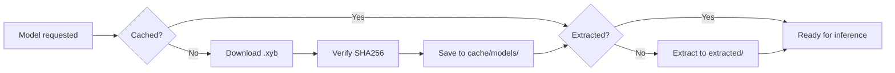

Xybrid caches downloaded model bundles locally so they only need to be fetched once. The cache location varies by platform.

## Cache Locations

| Platform | Default Path |
|----------|-------------|
| **macOS** | `~/.xybrid/cache/models/` |
| **Linux** | `~/.xybrid/cache/models/` |
| **Windows** | `~/.xybrid/cache/models/` |
| **iOS** | `~/Library/Application Support/Xybrid/Models/` |
| **Android** | `<app-internal-storage>/xybrid/models/` |

### Desktop (macOS, Linux, Windows)

On desktop platforms, models are stored under your home directory:

```
~/.xybrid/
├── cache/
│   └── models/                      # Downloaded .xyb bundles
│       ├── kokoro-82m.xyb
│       └── whisper-tiny@1.0.xyb
└── extracted/                       # Extracted model files (ready for inference)
    ├── kokoro-82m/
    │   ├── model_metadata.json
    │   ├── model.onnx
    │   ├── tokens.txt
    │   └── voices.bin
    └── whisper-tiny/
        ├── model_metadata.json
        └── model.safetensors
```

Bundles are stored as compressed `.xyb` files (tar + zstd). When a model is first used, the bundle is extracted to a sibling `extracted/` directory. Subsequent runs skip extraction.

### iOS

On iOS, the cache lives inside the app's sandboxed container:

```
~/Library/Application Support/Xybrid/Models/
```

The path is resolved using the `HOME` environment variable provided by the iOS runtime. No special configuration is required — the SDK handles this automatically.

### Android

Android **requires explicit initialization** before any model operations. The app must provide a writable directory at startup because Android apps don't have a predictable home directory.

**Flutter:**
```dart
import 'package:xybrid_flutter/xybrid_flutter.dart';

// This is handled automatically by Xybrid.init()
await Xybrid.init();
```

Under the hood, `Xybrid.init()` calls `path_provider` to get the app's internal storage directory and passes it to the Rust SDK via `init_sdk_cache_dir()`.

**Rust (direct):**
```rust
use xybrid_sdk::init_sdk_cache_dir;

// Must be called before any model operations
init_sdk_cache_dir("/data/data/com.example.app/files/xybrid/models");
```

If you skip this step on Android, model operations will fail with:

> Android requires cache directory to be configured. Call init\_sdk\_cache\_dir() first.

## Custom Cache Directory

On any platform, you can override the default cache location:

**Rust:**
```rust
use xybrid_sdk::init_sdk_cache_dir;

init_sdk_cache_dir("/path/to/custom/cache");
```

**Flutter:**
```dart
await Xybrid.init(cacheDir: '/path/to/custom/cache');
```

This sets the cache directory globally for the SDK lifetime. It also configures related environment variables (`HF_HOME`, `XDG_CACHE_HOME`) so that all subsystems use the same location.

## Cache Lifecycle



### Bundle naming

Downloaded bundles use the format `{model_id}@{version}.xyb`. If no version is specified, the filename is just `{model_id}.xyb`.

### Extraction

Extraction is idempotent — if the `extracted/{model_id}/` directory already exists, the SDK skips re-extraction. This means the first run of a new model is slightly slower (download + extract), but all subsequent runs start instantly.

### TTL & Cleanup

| Source | TTL |
|--------|-----|
| **Local models** | Persist indefinitely |
| **Cloud models** | 24 hours (configurable) |

Cloud model bundles are automatically cleaned up after their TTL expires. Local models (loaded from disk) are never automatically removed.

## Managing the Cache

### CLI

```bash
# Check cache status (model count, total size)
xybrid cache status

# List cached models
xybrid cache list

# Clear all cached models
xybrid cache clear
```

### Programmatic

```rust
use xybrid_sdk::CacheManager;

let cache = CacheManager::new()?;

// Check if a model is cached
if cache.is_cached("kokoro-82m") {
    println!("Model path: {:?}", cache.get_cached_path("kokoro-82m"));
}

// Get cache statistics
let status = cache.status()?;
println!("Models: {}, Size: {} MB", status.model_count, status.size_bytes / 1_000_000);

// Remove expired cloud models
cache.clean_expired()?;

// Clear everything
cache.clear()?;
```

## Integrity Verification

Every downloaded bundle is verified against a SHA256 checksum provided by the registry. The hash is stored in a sidecar file alongside the `.xyb` bundle so that future loads can skip re-verification.

If a bundle fails verification, it is discarded and re-downloaded on the next request.

## Troubleshooting

### "Model not found" after download

Check that the extracted directory contains a valid `model_metadata.json`:

```bash
ls ~/.xybrid/extracted/<model-id>/
```

If the directory is empty or missing, delete the `.xyb` file and re-download:

```bash
rm ~/.xybrid/cache/models/<model-id>.xyb
```

### Android: "cache directory not configured"

Ensure `Xybrid.init()` (Flutter) or `init_sdk_cache_dir()` (Rust) is called before any model operations. This must happen once at app startup.

### Cache taking too much disk space

Use the CLI to inspect and clean up:

```bash
xybrid cache status    # See total size
xybrid cache clear     # Remove everything
```

Or programmatically remove only expired cloud models:

```rust
CacheManager::new()?.clean_expired()?;
```
