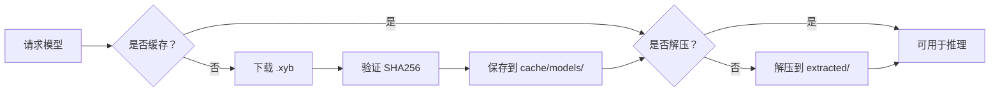

Xybrid 会在本地缓存已下载的模型，使其只需获取一次。缓存位置因平台而异。

## 缓存位置

| 平台 | 默认路径 |
|----------|-------------|
| **macOS** | `~/.xybrid/cache/models/` |
| **Linux** | `~/.xybrid/cache/models/` |
| **Windows** | `~/.xybrid/cache/models/` |
| **iOS** | `~/Library/Application Support/Xybrid/Models/` |
| **Android** | `<app-internal-storage>/xybrid/models/` |

### 桌面端（macOS、Linux、Windows）

在桌面平台上，模型存储在用户主目录下：

```
~/.xybrid/
├── cache/
│   └── models/                      # 已下载的 .xyb 包
│       ├── kokoro-82m.xyb
│       └── whisper-tiny@1.0.xyb
└── extracted/                       # 已解压的模型文件（可直接用于推理）
    ├── kokoro-82m/
    │   ├── model_metadata.json
    │   ├── model.onnx
    │   ├── tokens.txt
    │   └── voices.bin
    └── whisper-tiny/
        ├── model_metadata.json
        └── model.safetensors
```

Bundle 以压缩的 `.xyb` 文件（tar + zstd）存储。模型首次使用时，包会被解压到同级的 `extracted/` 目录中，后续运行即可跳过解压步骤。

### iOS

在 iOS 上，缓存位于应用的沙盒容器内：

```
~/Library/Application Support/Xybrid/Models/
```

路径通过 iOS 运行时提供的 `HOME` 环境变量解析，无需额外配置，SDK 会自动处理。

### Android

Android **需要在操作任何模型前明确初始化**。由于 Android 应用没有固定的主目录，应用必须在启动时提供一个可写目录。

**Flutter：**
```dart
import 'package:xybrid_flutter/xybrid_flutter.dart';

// 由 Xybrid.init() 自动处理
await Xybrid.init();
```

底层实现中，`Xybrid.init()` 调用 `path_provider` 获取应用内部存储目录，并通过 `init_sdk_cache_dir()` 传递给 Rust SDK。

**Rust（直接调用）：**
```rust
use xybrid_sdk::init_sdk_cache_dir;

// 必须在操作任何模型前调用
init_sdk_cache_dir("/data/data/com.example.app/files/xybrid/models");
```

如果在 Android 上跳过此步骤，模型操作将失败并报错：

> Android requires cache directory to be configured. Call init\_sdk\_cache\_dir() first.

## 自定义缓存目录

在任意平台上，可以覆盖默认缓存位置：

**Rust：**
```rust
use xybrid_sdk::init_sdk_cache_dir;

init_sdk_cache_dir("/path/to/custom/cache");
```

**Flutter：**
```dart
await Xybrid.init(cacheDir: '/path/to/custom/cache');
```

此操作在 SDK 生命周期内全局设置缓存目录，同时配置相关环境变量（`HF_HOME`、`XDG_CACHE_HOME`），确保所有子系统使用同一路径。

## 缓存生命周期



### Bundle 命名

已下载的 Bundle 使用 `{model_id}@{version}.xyb` 格式命名。若未指定版本，文件名为 `{model_id}.xyb`。

### 解压

解压操作是一次性的——如果 `extracted/{model_id}/` 目录已存在，SDK 会跳过重新解压。因此新模型的首次运行稍慢（下载 + 解压），后续运行均可立即启动。

### TTL 与清理

| 来源 | TTL |
|--------|-----|
| **本地模型** | 永久保留 |
| **云端模型** | 24 小时（可配置） |

云端模型在 TTL 到期后会自动清理，本地模型（从磁盘加载）永不自动删除。

## 管理缓存

### CLI

```bash
# 检查缓存状态（模型数量、总大小）
xybrid cache status

# 列出已缓存的模型
xybrid cache list

# 清除所有缓存模型
xybrid cache clear
```

### 编程方式

```rust
use xybrid_sdk::CacheManager;

let cache = CacheManager::new()?;

// 检查模型是否已缓存
if cache.is_cached("kokoro-82m") {
    println!("Model path: {:?}", cache.get_cached_path("kokoro-82m"));
}

// 获取缓存统计信息
let status = cache.status()?;
println!("Models: {}, Size: {} MB", status.model_count, status.size_bytes / 1_000_000);

// 删除过期的云端模型
cache.clean_expired()?;

// 清除所有内容
cache.clear()?;
```

## 完整性验证

每个下载的 Bundle 都会通过注册表提供的 SHA256 校验和进行验证。哈希值存储在 `.xyb` Bundle 旁的附属文件中，以便后续加载时跳过重新验证。

若 Bundle 验证失败，将被删除，并在下次请求时重新下载。

## 故障排查

### 下载后提示"模型未找到"

检查解压目录中是否包含有效的 `model_metadata.json`：

```bash
ls ~/.xybrid/extracted/<model-id>/
```

若目录为空或不存在，删除 `.xyb` 文件并重新下载：

```bash
rm ~/.xybrid/cache/models/<model-id>.xyb
```

### Android："缓存目录未配置"

确保在任何模型操作前调用 `Xybrid.init()`（Flutter）或 `init_sdk_cache_dir()`（Rust）。该操作必须在应用启动时执行一次。

### 缓存占用磁盘空间过大

使用 CLI 检查并清理：

```bash
xybrid cache status    # 查看总大小
xybrid cache clear     # 删除所有内容
```

或通过代码仅删除过期的云端模型：

```rust
CacheManager::new()?.clean_expired()?;
```
