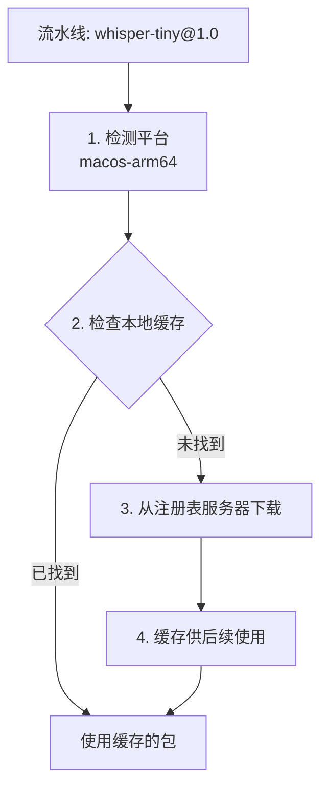

**注册表**是 Xybrid 的模型分发系统，负责组织、版本管理和向 SDK 及应用分发模型包。

## 工作原理



## 注册表结构

Bundle 包含模型 ID、版本和平台：

```
~/.xybrid/registry/
├── index.json                          # Bundle 索引
├── wav2vec2-base-960h/
│   └── 1.0/
│       ├── macos-arm64/
│       │   └── wav2vec2-base-960h.xyb
│       └── ios-arm64/
│           └── wav2vec2-base-960h.xyb
├── whisper-tiny/
│   └── 1.0/
│       └── macos-arm64/
│           └── whisper-tiny.xyb
└── kokoro-82m/
    └── 0.1/
        └── macos-arm64/
            └── kokoro-82m.xyb
```

## index.json

索引文件记录所有可用的 Bundle：

```json
{
  "wav2vec2-base-960h/1.0/macos-arm64": {
    "model_id": "wav2vec2-base-960h",
    "version": "1.0",
    "target": "macos-arm64",
    "size_bytes": 377654321,
    "path": "~/.xybrid/registry/wav2vec2-base-960h/1.0/macos-arm64/wav2vec2-base-960h.xyb"
  }
}
```

## 平台检测

注册表会自动检测当前平台：

| 平台 | 标识符 |
|----------|------------|
| macOS（Apple Silicon） | `macos-arm64` |
| macOS（Intel） | `macos-x86_64` |
| iOS | `ios-arm64` |
| Android | `android-arm64` |
| Linux | `linux-x86_64` |
| Windows | `windows-x86_64` |

## 在流水线中使用

在流水线 YAML 中引用注册表 URL：

```yaml
name: "Speech to Text"
registry: "http://localhost:8080"

stages:
  - wav2vec2-base-960h@1.0
```

### 注册表配置选项

**简单 URL：**
```yaml
registry: "http://localhost:8080"
```

**文件路径（本地）：**
```yaml
registry: "file:///Users/me/.xybrid/registry"
```

## 解析流程

当流水线引用 `whisper-tiny@1.0` 时：

1. **解析引用** — 提取模型 ID 和版本
2. **检测平台** — 确定当前平台
3. **检查缓存** — 在 `~/.xybrid/registry/` 中查找
4. **下载** — 若未缓存则从注册表服务器获取
5. **解压** — 解压 `.xyb` 包
6. **加载** — SDK 读取 `model_metadata.json` 并初始化模型

## 相关文档

- [Bundle](/zh/docs/concepts/bundles) — Bundle 格式与元数据
